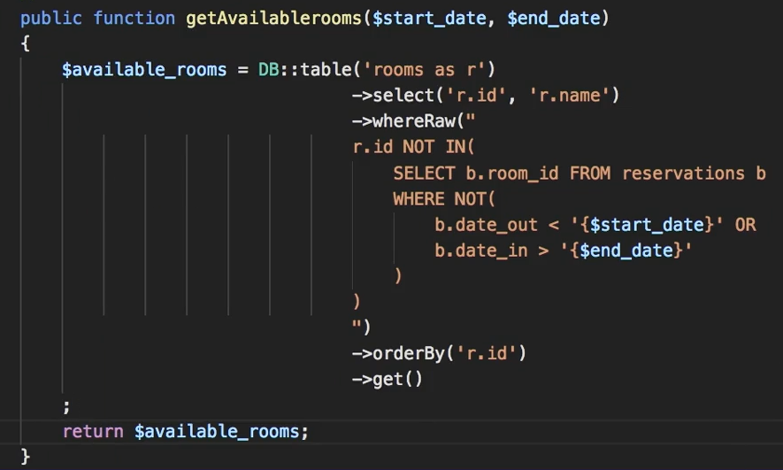
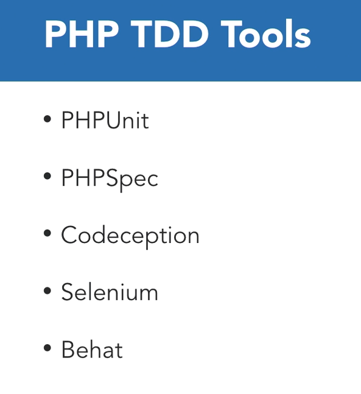

## Dependency Injection in Laravel

```php
class Title {
    public titleArray = ['this','that','some','thing'];
    public function getAll() {
        return $this->titleArray;
    }
    public function getById($id) {
        return $this->titleArray[$id]
    }
}
// now we inject it in a controller , like bellow :
use App\Title
    
class TestController extends Contorller {
    public function __construct(Title $title) {
        $this->titles = $title->getAll();
    }
    public function di() {
        dd($this->titles);
    }
}
```

### Best way to Save Data with array OR sending it to View with $data


> after that we say > `$client->insert($data)`

--------------

### Using Raw Query in Laravel

```php
public function getAvailableRooms($startDate,$endDate) {
    $available_rooms = DB::table('room as r')->select('r.id','r.name')
        					->whereRaw("
        					r.id NOT IN(
        						SELECT b.room_id FROM reservations b
        						WHERE NOT(
        							b.date_out < '{$startDate}' OR
        							b.date_in > '{$endDate}'
        						)
        					)
        					")
        					->orderBy('r.id')->get();
    return $available_rooms;
}
```



## TDD

> we have two types of test
>
> - Unit Test ( which means we isolate a component and test just that component )
> - Functional Test ( testing a feature with the whole context of the applicatioin )



### Writin TDD in Laravel

> first open the `test` folder , in it there is an example file , open it .
>
> :notebook_with_decorative_cover: Attention that every test function you write , must begin with `test`
>
> we run the test by typing the following it the terminal
>
> ```
> > ./vendor/phpunit/phpunit/phpunit
> ```

### Working With Session

```php
$request->session()->put('client_username',$client_username);
// on another page
$client_username = $request->session()->has('client_username') ? $request->session()         ->pull('client_username') :
'none';
```

> thus you know that to work with the Sessions , you need to add Request $request to the parameters of the function , then you set session with : `$request->session->put('key','value')` , and to get it we have must do : `$request->session()->pull('key')` .

## Using MiddleWare `auth` For a Group

> to do that we will do as bellow :
>
> ```php
> Route::middleware('auth')->group(function(){
>    // now put your urls in here 
> });
> Route::middleware('auth')->group(function() {
>     Route::get('/',[ArashController,'index'])->name('index');
>     Route::get('/',[ArashController,'index'])->name('index');
>     Route::get('/',[ArashController,'index'])->name('index');
> })
> ```

### Force a Download

> for this porpuse we use `header` , like bellow :
>
> ```php
> public function export() {
>     header('content-disposition:attachment;filename=export.xls');
> 	return view('arash.export');
> }
> Route::get('/export',[ArashController,'export']);
> ```

### Uploading Files In Laravel

> for this porpuse we use `Illuminate\support\Facade\Input` , like bellow :
>
> ```php
> public function upload(Request $request) {
>     $data = [];
>     if($request->isMethod('post')) {
>  		$this->validate($request,[
>     		'image_upload' => 'mimes:jpeg,bmp,png'
> 		])
> 	Input::file('image_upload')->move('images','attractions.jpng');
> 	// as you see we move the file with 'move('images')' to the images folder .       
>     }
>     return view('contents/upload',$data);
> }

## Seeding The Database

> we create `Seeder` with :
>
> ```
> php artisan make:seeder UserTableSeeder
> ```
>
> then we enter the `UserTableSeeder` file , and we have :
>
> ```php
> use Illuminate\Database\Seeder;
> 
> class TitleTableSeeder extends Seeder
> {
>     public function run()
>     {
>         DB::table('titles')->insert([
>             'name' => 'arash',
>             'family' => 'samandar',
>             'email' => 'arash.internet@gmail.com'
>         ]);
>         DB::table('titles')->insert([
>             'name' => 'arash',
>             'family' => 'samandar',
>             'email' => 'arash.internet@gmail.com'
>         ]) // and we can do it multiple times to put more seeds
>     }
> }
> ```
>
> and lastly we open the main file , which name is DatabaseSeeder, and is like bellow
>
> ```php
> use Illuminate\Database\Seeder;
> 
> class DatabaseSeeder extends Seeder
> {
>     public function run()
>     {
>         $this->call(TitleTableSeeder::class);
>         // and we our other seeder files like above
>     }
> }
> ```
>
> and we run it with bellow command :
>
> ```
> php artisan migrate:refresh --seed
> ```